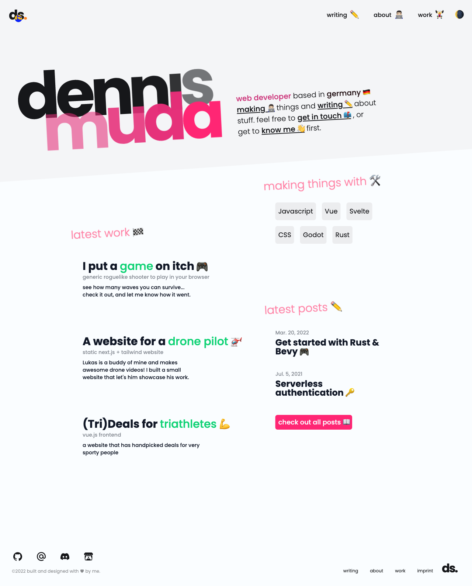
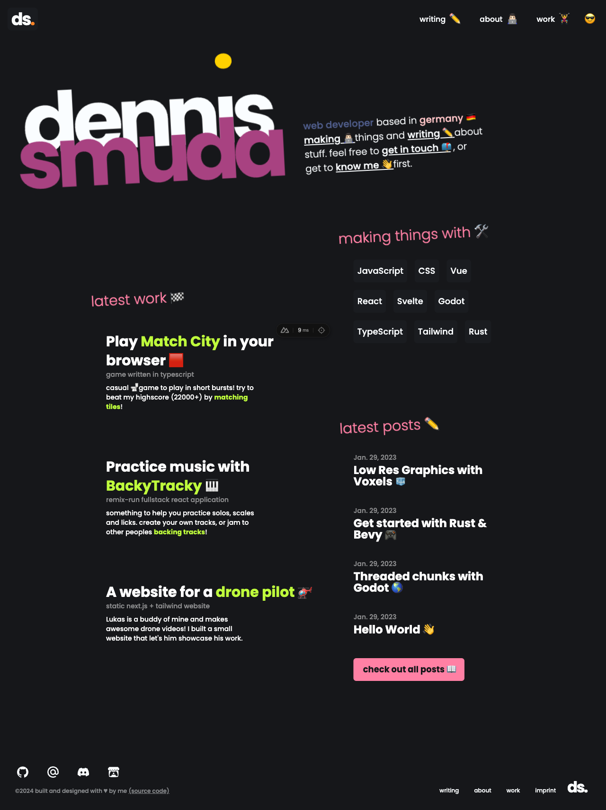

# Personal Website 👨🏻‍💻

[](https://github.com/DennisSmuda/dennissmuda-website/actions/workflows/main.yml)

This is the code for my website! You can [see it live](https://dennissmuda.com/) here!

<p align="left" style="padding: 4rem 8rem 4rem 0;">
<a href="https://pagespeed.web.dev/report?url=https%3A%2F%2Fdennissmuda.com%2F&form_factor=desktop">

</a>
</p>

<!--  -->



## Developing 🛠

After you've cloned/forked/whatever the repo, you can do this:

```bash
npm run install
npm run dev
# or start the server and open the app in a new browser tab
npm run dev -- --open
```

## Tests 🧪

Tests run on [github actions](https://github.com/DennisSmuda/dennissmuda-website/actions), everytime a PR gets opened.

To run playwright locally, I recommend the official [vs code plugin] - which is amazingly convenient - you can also just run `npm t`. But you have to `useExistingServer` inside `playwright.config.js`.

## Contributions 🥁

Feel free to submit PRs or [issues](https://github.com/DennisSmuda/dennissmuda-website/issues) 👋
