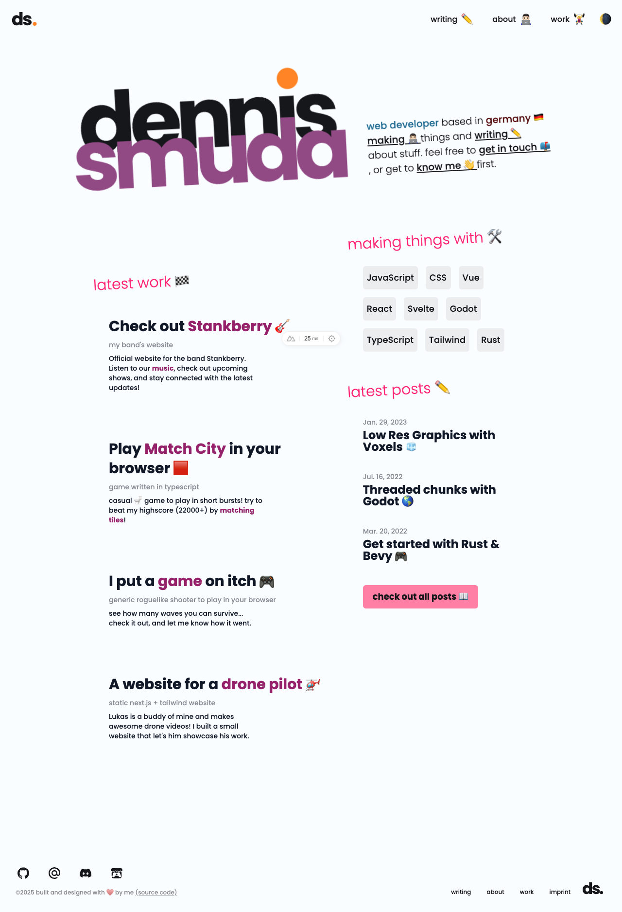

# My Personal Website 👨🏻‍💻

[](https://github.com/DennisSmuda/dennissmuda-website/actions/workflows/playwright.yml)
[](https://github.com/DennisSmuda/dennissmuda-website/actions/workflows/vitest.yml)
[](https://github.com/DennisSmuda/dennissmuda-website/actions/workflows/lint.yml)
[](https://app.netlify.com/sites/dennissmuda/deploys)

This is the code for my website! You can [see it live](https://dennissmuda.com/) here!

---

<p align="left">
  
</p>

| Dark Theme                                | Light Theme                     |
| ----------------------------------------- | ------------------------------- |
|  |  |

## Developing 🛠

After you've cloned/forked/whatever the repo, you can do this:

```bash
# install dependencies
npm run install

# start dev server http://localhost:3000/
npm run dev
```

## Tests 🧪

All tests run on [github actions](https://github.com/DennisSmuda/dennissmuda-website/actions), everytime a PR gets opened.

### Component Tests

Run Component tests in the project root:

```bash
# run in watch mode
npm run test

# with coverage
npm run test:coverage
```

### E2E Tests

To run playwright locally, your dev server needs to be running (`npm run dev` in a second terminal).

```bash
# so the tests run against localhost:3000
npm run dev

# run playwright tests
npm run test:e2e
```

### Lint

I use [antfu's config](https://github.com/antfu/eslint-config) to lint all the code in this repo. Follow the instructions for editor support!

```bash
# lint project
npm run lint

# with automatic fixes
npm run lint:fix
```

## Contributions 🥁

Feel free to submit PRs or [issues](https://github.com/DennisSmuda/dennissmuda-website/issues) 👋
